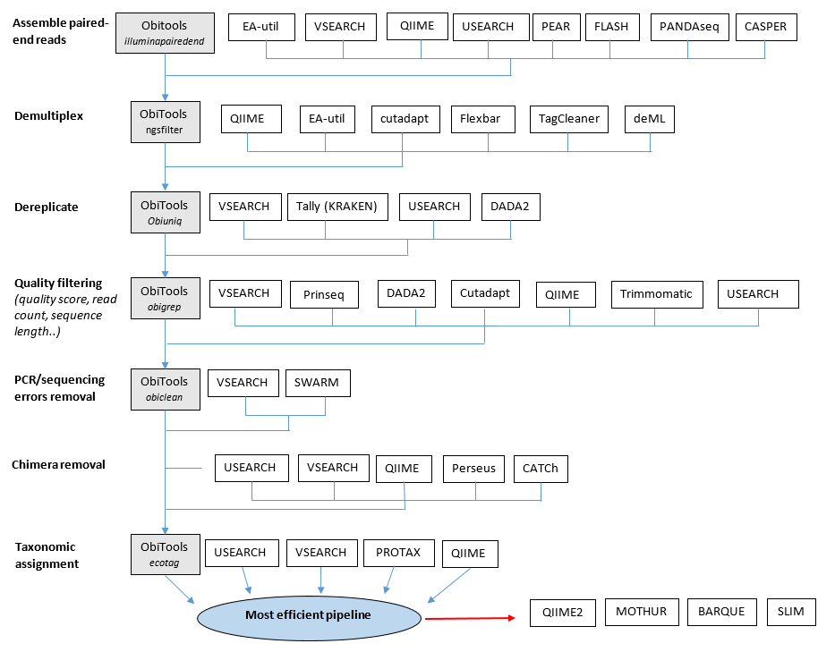
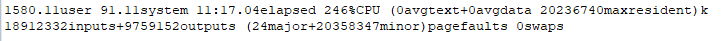

 [](https://singularity-hub.org/collections/2878)

# benchmark_pipelines

Assessment of metabarcoding data pipelines :
The goal of this study is to compare the performance of several bioinformatic tools to analyze fish eDNA data.
Six steps of the analysis were identified, from the assembly of paired-end reads to the taxonomic assignation.
For each of these steps, different programs to compare were identified, as shown below :



For each step, all the programs are compared, while the start and the end of the pipeline are standardized with a reference pipeline ([obitools_reference](benchmark_simulated_dataset/obitools_reference/total_obitools.sh)). This pipeline is based on [Obitools](https://git.metabarcoding.org/obitools/obitools/wikis/home), a set of python programs designed to analyse Next Generation Sequencer outputs (illumina) in the context of DNA Metabarcoding.

The optimal pipeline obtained will be again compared to existant complete pipelines (QIIME2 and BARQUE).

The comparison is made first on simulated data ([benchmark_simulated_dataset]([benchmark_simulated_dataset)), to be able to assess the performance of each program to retrieve the samples taxonomic composition. The comparison is also verified on a real dataset ([benchmark_real_dataset]([benchmark_real_dataset)), composed of samples from Carry-le-Rouet reserve, France.

# Dependencies

* [BASH](https://www.gnu.org/software/bash/)
	- [openssl](https://www.openssl.org/)
	- [wget](https://www.gnu.org/software/wget/)
	- [curl](https://curl.haxx.se/)

* [Singularity](https://www.sylabs.io/docs/)

# Installation

## Install from source code

To install all the programs used in this study, please follow the instructions on their installation pages : [ObiTools](https://pythonhosted.org/OBITools/welcome.html#installing-the-obitools), [VSEARCH](https://github.com/torognes/vsearch), [PEAR](http://www.exelixis-lab.org/web/software/pear), [FLASH](https://sourceforge.net/projects/flashpage/files), [CASPER](http://best.snu.ac.kr/casper/index.php?name=manual), [fastq-join](https://github.com/brwnj/fastq-join), [NGmerge](https://github.com/jsh58/NGmerge), [fastp](https://github.com/OpenGene/fastp), [cutadapt](https://cutadapt.readthedocs.io/en/stable/installation.html), [Prinseq](https://sourceforge.net/projects/prinseq/files/), [SWARM](https://github.com/torognes/swarm) and [SINTAX](https://www.drive5.com/usearch/manual/cmd_sintax.html).

The installation guidelines for the complete pipelines can be found here : [QIIME2](https://docs.qiime2.org/2019.4/install) and [BARQUE](https://github.com/enormandeau/barque).

## Singularity containers

Other possibility : all the programs have been installed in a [Singularity container](https://www.sylabs.io/docs/), which you can access here :

First you need to install [Singularity](https://github.com/sylabs/singularity/blob/master/INSTALL.md).

We provide ready to run versions of [Singularity containers](https://www.sylabs.io/).

Our complete collection of singularity recipes is available [here](https://github.com/Grelot/bioinfo_singularity_recipes).

Download containers in `99_utils/containers/` :

* [ObiTools](https://pythonhosted.org/OBITools/welcome.html#installing-the-obitools)'s container :
```
singularity pull --name obitools.simg shub://Grelot/bioinfo_singularity_recipes:obitools
```

* container with vsearch, PEAR, FLASh, CASPER, cutadapt, fastq-join, Tally, Prinseq, usearch (sintax), SWARM, Flexbar, Python2 :
```
singularity pull --name ednatools.simg shub://Grelot/bioinfo_singularity_recipes:ednatools
```


# Data requirement

## Input FASTQ files and Reference database

The simulated dataset used for this study, containing forward and reverse reads from 12S mitochondrial gene fragment of fish, has been simulated with [Grinder](https://sourceforge.net/projects/biogrinder/). For the full simulation protocole, please visit https://github.com/lmathon/metabarcoding_data_simulation.

The dataset is stored on MEGA. To dowload, uncrypt and unzip `forward_reverse_reads` from our [MEGA cloud](https://mega.nz/), run :

```
bash 99_utils/mega_download/download_input_data.sh
```
The `forward_reverse_reads` folder will be created at [benchmark_simulated_dataset/00_Input_data/forward_reverse_reads](benchmark_simulated_dataset/00_Input_data/forward_reverse_reads).

The reference database files needed for the taxonomic assignment with OBITools are also stored on MEGA and will be downloaded at the same time as the input FASTQ files. These files will be stored in [benchmark_simulated_dataset/00_Input_data/reference_database](benchmark_simulated_dataset/00_Input_data/reference_database).

The FASTQ inputs of the dataset from Carry-le-Rouet will be available on public databases upon publication. Reference databases used with this dataset are available [here](benchmark_real_dataset/00_Input_data/reference_database).

## Sample description file

The sample description file, containing the primers and the tags associated to each sample, is available [here](benchmark_simulated_dataset/00_Input_data/sample_description_file.txt) for the simulated dataset, and [here](benchmark_real_dataset/00_Input_data/sample_description_file.txt).

## Abundance data 

Thanks to the simulated dataset, we know exactly the relative abundance of each species in each sample and replicate. These data can be found [here](benchmark_simulated_dataset/00_Input_data/species_abundance_per_sample) and will be compared to the output of each pipeline tested to assess their efficiency.

(Note that the input FASTQ files and the abundance data will change each time you run a grinder simulation. The files given here correspond to the grinder simulation made to obtain the data for our program comparison)
  
# Performance measures

To assess the efficiency of each program, we measure the execution time (among other metrics).

Each time you test a different program for a given analysis step, you can record the time, memory usage, and CPU usage of this command by running `time` in front of the command :

```
/usr/bin/time command [-options]
```
This will give this output in the standard error file :



where :

%elapsed = time in hours:minutes:seconds


Other performance metrics will be calculated for each pipeline tested : sensitivity and F-measure index will be calculated from the number of true positive, false positive and false negative output by each pipeline. 
Relative abundances output by each pipeline are compared to the expected abundances ([species_abundance_per_sample](benchmark_simulated_dataset/00_Input_data/species_abundance_per_sample)).

To run any script, run this command line :

```
bash 99_utils/submitjob_sge_cluster/bash2sge.sh SCRIPT.sh
qsub
```

# Configuration of paths

Before running any script of the analysis, make sure the config file is up to date, with the right path for each file. These config files are in the `98_infos` folder of each benchmark folder ([here](benchmark_simulated_dataset/98_infos) for the simulated dataset and [here](benchmark_simulated_dataset/98_infos) for the real dataset).

# Analysis steps

For simplicity, each pipelines are separated in folders corresponding to the steps, in [01_merging](benchmark_simulated_dataset/01_merging), [02_demultiplex](benchmark_simulated_dataset/02_demultiplex), [03_dereplication](benchmark_simulated_dataset/03_dereplication), [04_filtering](benchmark_simulated_dataset/04_filtering), [05_error](benchmark_simulated_dataset/05_error) and [06_assignation](benchmark_simulated_dataset/06_assignation). 

## 1 - Merging paired-end reads

The first step consists in assembling forward and reverse reads of the sequences. We tested several assemblers, with no specific parameters.

[01_merging](benchmark_simulated_dataset/01_merging) contains the scripts to run each of these programs.

## 2 - Demultiplexing

Once the reads assembled, the primers are removed (max. 2 mismatches allowed by primers). The tags are also removed (no mismatch allowed) and each read is assigned to the sample it comes from.

[02_demultiplex](benchmark_simulated_dataset/02_demultiplex) contains the scripts to run each programs used at this step.

## 3 - Dereplicating

The reads are then dereplicated: identical reads are gathered in a unique read and the count is saved.

All the scripts to run the different programs are in [03_dereplication](benchmark_simulated_dataset/03_dereplication).

## 4 - Quality filtering

Reads are then checked for their quality : sequences longer than 20bp and with no ambiguous bases are kept.

The scripts to run the different programs are in [04_filtering](benchmark_simulated_dataset/04_filtering)

## 5 - PCR / Sequencing error removal

Each program or pipeline offers different tools to remove PCR or sequencing errors. For ObiTools, the program obiclean keeps only the head sequences for each PCR replicate.

The scripts for the different programs are in [05_error](benchmark_simulated_dataset/05_error).

## 6 - Taxonomic assignation

The last step of the analysis is to assign every sequence to a taxa. In our case, we use a homemade reference database. To be assigned at the species level, the query sequence must be at least similar at 98% to the reference sequence.

[06_assignation](benchmark_simulated_dataset/06_assignation) contains the scripts to run the different assigning programs.


# Outputs

## Taxa/sample tables

The outputs of each pipeline tested can be found in the `Outputs` folder, in the folder corresponding to the step tested, under the name of the program tested.
The `main` folder contains all the intermediate files produced by the pipeline. The `final` folder contains the taxonomic table.
For example, to find the results of the pipeline testing the program flash for merging reads : 01_merging/Outputs/02_flash/final/merging_flash.csv

## Time and memory reports

Time reports for each program compared are stored [here](99_utils/submitjob_sge_cluster/qsub_outputs).

# Optimized pipeline

The most performant programs for each step were assembled into a pipeline, and compared to the other complete pipelines. The scripts for this pipeline is in [benchmark_simulated_dataset/optimized_pipeline](benchmark_simulated_dataset/optimized_pipeline).

# Real dataset

The comparison adapted for a real dataset can be found in [benchmark_real_dataset](benchmark_real_dataset), and is built with the same structure as with simulated data.